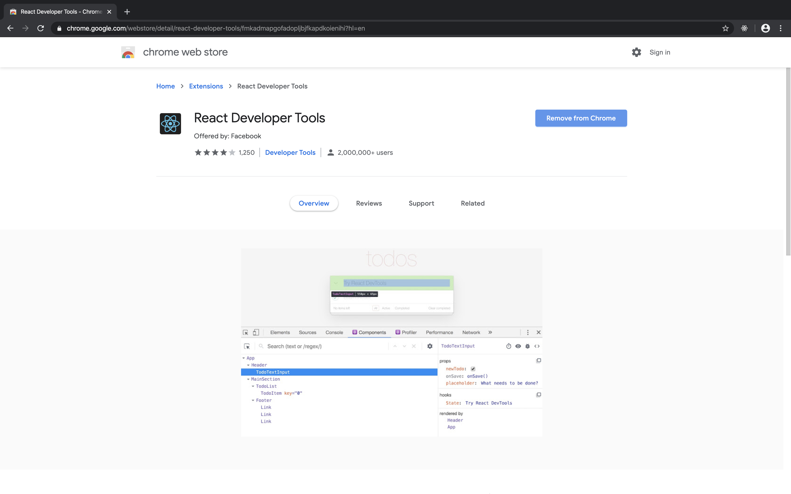
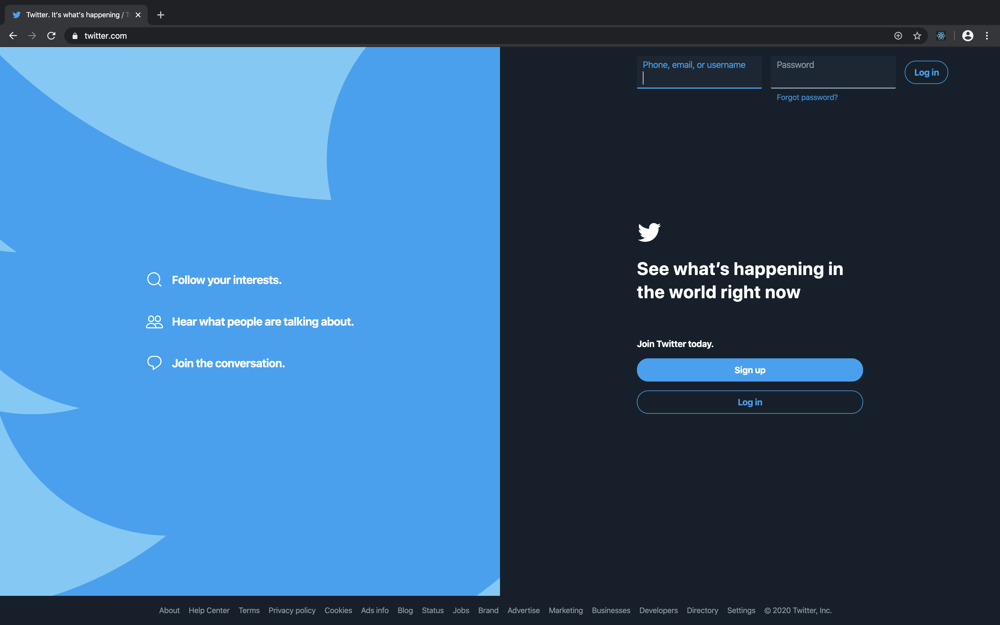
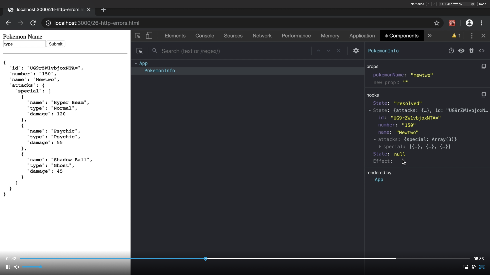
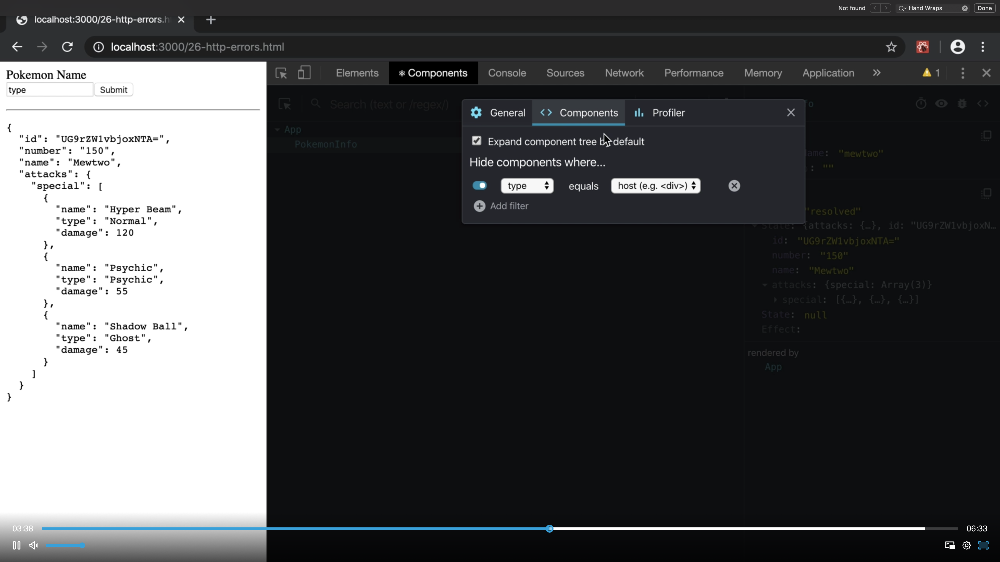
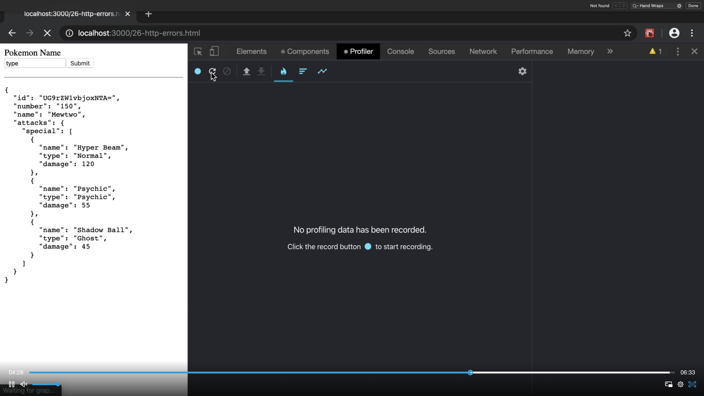

# 27. Install and use React DevTools

#### [📹 Video](https://egghead.io/lessons/egghead-v2-27-install-and-use-react-devtools?pl=a-beginners-guide-to-react-v2-6c4d)

## Notes

- It’s dangerous to go alone. Here take this: [React DevTools](https://chrome.google.com/webstore/detail/react-developer-tools/fmkadmapgofadopljbjfkapdkoienihi?hl=en)
- The React Developer Tools extension is extremely useful in developing and debugging React applications. In this lesson we’ll get it installed and play around with some of the features. Definitely take some time to play around with the DevTools on your own. You’ll be using these a lot.

- Installing from Chrome Tools:

- Checking for a production build:

- Inspecting with dev tools:

- Theme and filtering:

- Using the profiling:

- It's strongly advise that you install the React DevTools and play around with them so you become familiar with their capabilities and make you more productive developing React applications.

## Additional resource

- [Kent's Livestream - React DevTools](https://www.youtube.com/watch?v=DQjMiKEwl_E&feature=youtu.be)
- [React Docs - Introducing the New React DevTools](https://reactjs.org/blog/2019/08/15/new-react-devtools.html)
- [Repo - React Developer Tools](https://github.com/bvaughn/react-devtools)
