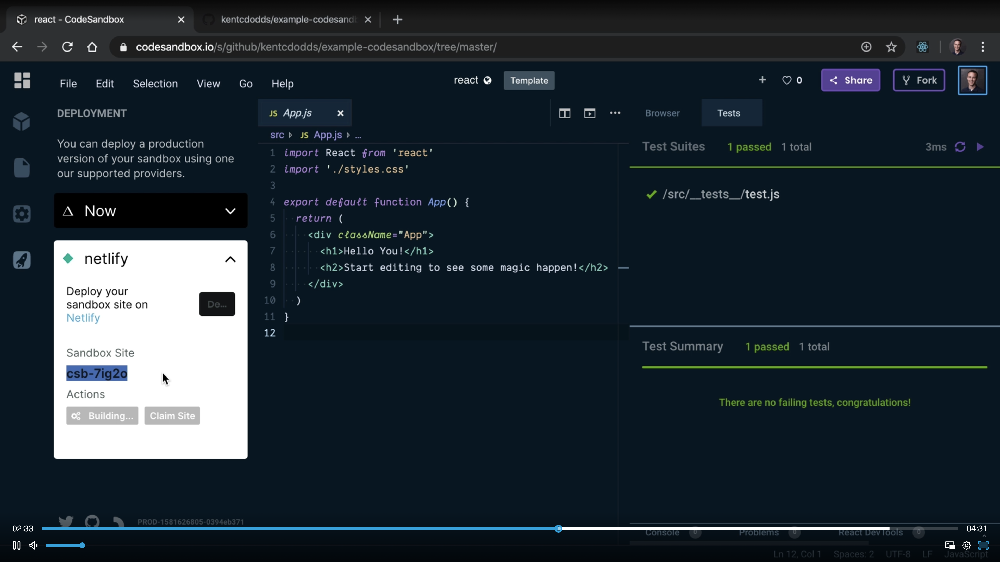
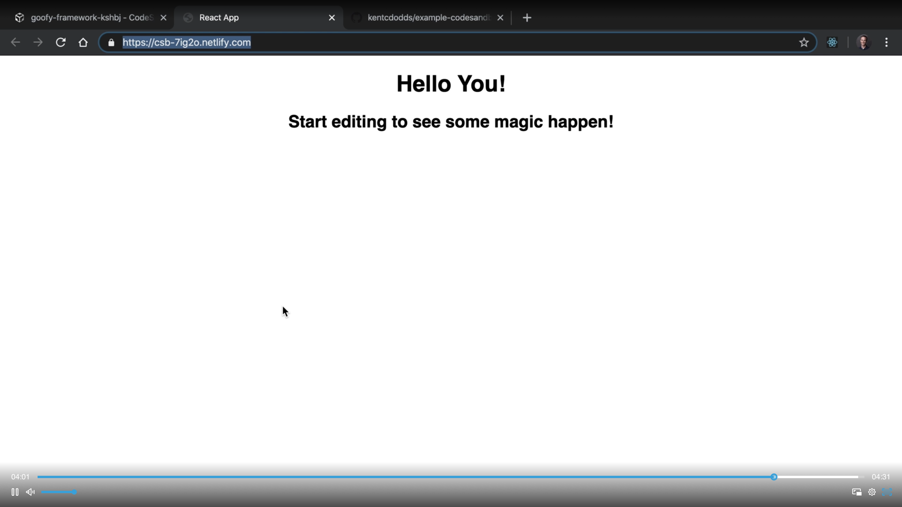

# 28. Build and deploy a React Application

#### [📹 Video](https://egghead.io/lessons/egghead-v2-28-build-and-deploy-a-react-application-with-codesandbox-github-and-netlify?pl=a-beginners-guide-to-react-v2-6c4d)

## Notes

- Once you've figured out how React works locally in an index.html, you probably want to build an actual application and the best next place to start is by going to [codesandbox.io](codesandbox.io).

- There are a ton of things that you can do in CodeSandbox. You can add dependencies from npm, you can add external resources, you can even change your typeface.
- I can create a new repository. Example, CodeSandbox. We'll click Create Repository and CodeSandbox will create a repository on GitHub based on what I have right here.

- You can also deploy with Netlify.

- Within Netlify, you can even make a custom domain and so you could create an entire application using just CodeSandbox, Netlify, and GitHub.

## Additional resource

- [CodeSandbox](https://codesandbox.io)
- [Netlify](https://www.netlify.com)
